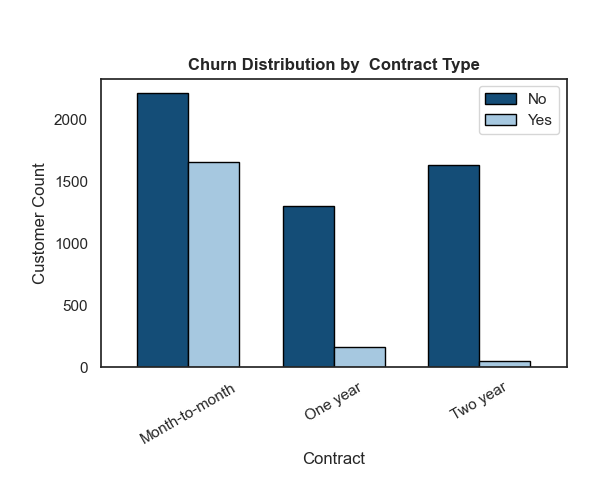
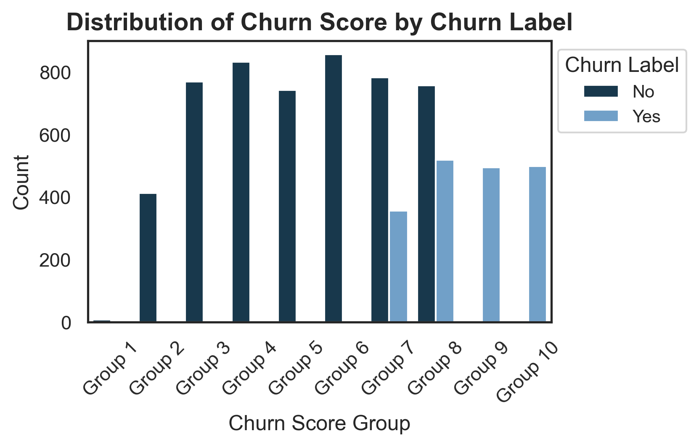
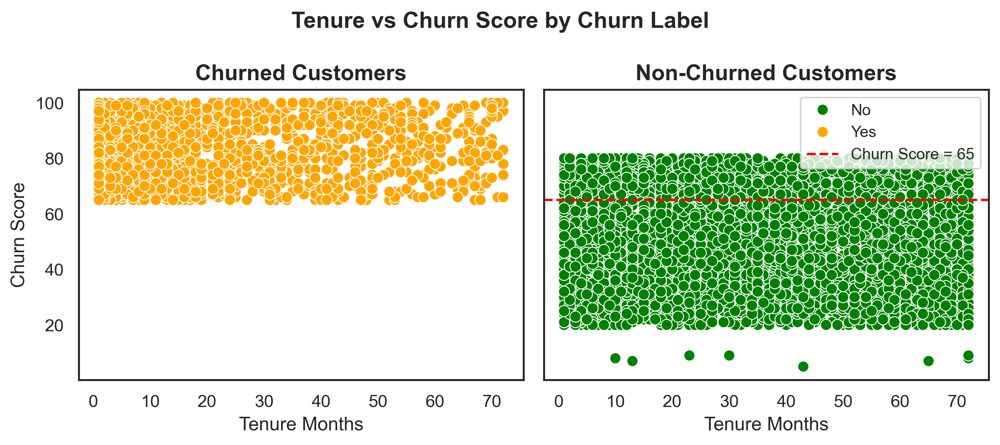
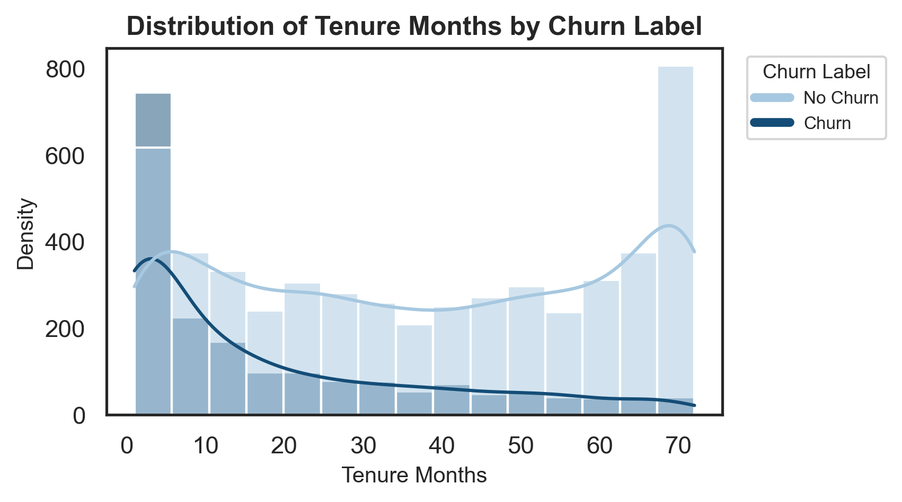
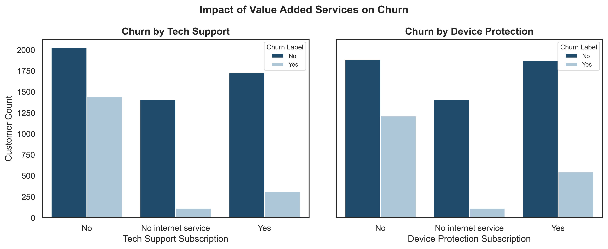
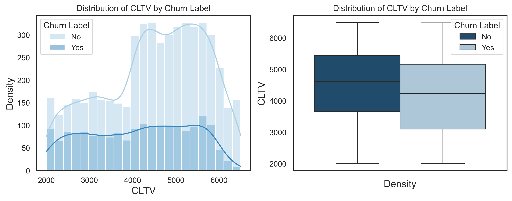
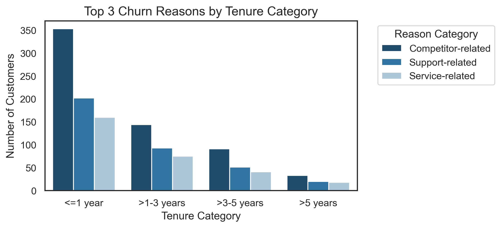

# Telco Customer Churn Analysis

## Background and Overview
This project analyzes a **fictional Telco customer churn dataset** sourced from IBM, representing a company providing home phone and Internet services in California. The dataset encompasses the behaviors of **7043 customers** in Q3, capturing key information such as demographics, service subscriptions, churn status, churn score, and **Customer Lifetime Value (CLTV)**.

Our goal is to identify the drivers behind customer churn and derive actionable insights to improve retention strategies. This analysis focuses on understanding customer churn patterns, customer segments, and how various factors—such as service types, tenure, demographics, and CLTV—contribute to churn rates.

The complete analysis, including code, visualizations, and insights, can be viewed in the project notebook: [View Full Project Notebook](EDA_on_Telco_Customer_Churn.ipynb).

## Data Structure Overview
The dataset comprises **33 variables**, including:
- **Demographic Information**: Customer ID, gender, seniority, location, etc.
- **Service Subscriptions**: Phone service, internet service, tech support, etc.
- **Churn-related Metrics**: Churn label, churn reason, churn score, etc.
- **Customer Lifetime Value (CLTV)** and **Tenure** details

### Key Columns:
- **Churn**: Whether the customer has churned (Yes/No)
- **Churn Score**: A score indicating the likelihood of churn.
- **CLTV**: The estimated customer lifetime value.
- **Tenure**: The length of time the customer has been with the company.
- **Service Features**: Attributes like Phone Service, Internet Service, Tech Support, etc.
- **Churn Reason**: The reason why the customer left.

### Executive Summary

The churn rate in this dataset stands at **27%**, indicating that nearly one in four customers leave the service. Key findings highlight the impact of competitor offerings, poor support experiences, and pricing concerns on churn. Early tenure customers and those with low Customer Lifetime Value (CLTV) are particularly at risk.

Key insights include:

- **Churn Score**: Scores of **65 or above** strongly correlate with churn, suggesting that a higher churn score indicates a higher likelihood of customer attrition.
  
- **Tenure**: **40% of churned customers** have been with the company for **1 year or less**, emphasizing the importance of the initial customer experience for retention.
  
- **Churn Reasons**: **Competitor-related issues** and **poor support experiences** are the primary drivers of churn, with customers citing better offers, faster speeds, and poor support attitudes as key reasons for leaving.

- **Contract Type**: Customers on **month-to-month contracts** are at the highest risk of churn (**42.7%**), while those on **two-year contracts** have a much lower churn rate (**2.8%**), indicating that longer commitment plans help reduce churn.

- **CLTV**: Churned customers have an **8% lower average CLTV** compared to retained customers, underlining the importance of nurturing high-value relationships to prevent churn.

---

## Insights Deep Dive  

### 1. **Contract Type Insights**  
- **Month-to-month** contracts have the highest churn rate (**42.7%**), contributing heavily to overall churn.  
- **Two-year contracts** show the lowest churn rate (**2.8%**), indicating that longer commitment periods significantly enhance retention.  
- **Recommendation**: Encourage customers to opt for longer-term contracts to reduce churn, focusing on offering incentives for long-term commitments.  

  

---

### 2. **Churn Score Insights**  
- Customers with churn scores **≥ 65** make up **75%** of churned customers, indicating they are highly at risk of leaving.  
- Customers with churn scores **< 65** are significantly more likely to stay, highlighting the predictive power of the churn score for early intervention.  
- **Recommendation**: Focus on targeted retention strategies for customers with churn scores above 65 to prevent potential churn.  

   
   
   

---

### 3. **Tenure vs. Churn**  
- **40%** of churned customers have been with the company for **1 year or less**, emphasizing the importance of customer experience during the early tenure period.  
- Customers with **>3 years of tenure** show much stronger retention, with churn dropping to **5%**.  
- **Recommendation**: Strengthen onboarding and engagement efforts in the first year to improve retention, while continuing to nurture long-term relationships.  
 
    

---

### 4. **Value-Added Services Insights**  
- Customers who subscribe to **value-added services** (e.g., online security, backup, tech support) experience **15%-22%** lower churn rates compared to non-subscribers (**39%-41%**).  
- **Recommendation**: Increase customer engagement with value-added services to improve retention, as they provide a significant reduction in churn.  

     
---

### 5. **Customer Lifetime Value (CLTV) Insights**  
- Churned customers have an **8% lower** average CLTV compared to retained customers.  
- Customers with higher CLTVs and longer tenures show significantly better retention, reinforcing the importance of nurturing high-value relationships.  
- **Recommendation**: Prioritize high-CLTV customers for retention efforts and create loyalty programs to enhance long-term customer relationships.  

     

---

### 6. **Churn Reason Breakdown**  
- The top churn reasons are **competitor-related reasons** (33%), **support-related issues** (20%), and **pricing concerns** (11%).  
- Customers cite competitor-related reasons, such as higher speeds or better data packages, while support issues like poor attitudes also contribute significantly to churn.  
- **Recommendation**: Address competitor-related concerns by improving service offerings and introducing competitive pricing, while enhancing customer support quality to improve retention.  

     

---

## Recommendations  

1. **Enhance Onboarding and Early Engagement:**  
   - Target customers in their first year of tenure, where churn is highest (**40%**). Focus on seamless onboarding, proactive engagement, and personalized support.  

2. **Leverage Churn Score for Retention:**  
   - Implement predictive retention strategies for customers with churn scores **≥ 65**, who make up **75%** of churned customers.  

3. **Improve Competitiveness:**  
   - Address the **33%** of churn due to competitor advantages by offering flexible pricing plans, higher speeds, and customizable service bundles.  

4. **Strengthen Customer Support:**  
   - Train support teams to reduce churn from **20%** of customers citing poor support experiences as their reason for leaving.  

5. **Reassess Pricing Strategies:**  
   - Introduce affordable and flexible pricing options to mitigate churn related to pricing concerns (**11%**).  

6. **Promote Long-term Contracts:**  
   - Increase incentives for one- and two-year contracts to reduce churn from month-to-month plans (**43% churn rate**).  

7. **Focus on Value-Added Services:**  
   - Encourage subscriptions to services like tech support, online security, and device protection, which lower churn rates to **15%-22%** compared to **39%-41%** without these services.  

8. **Segment High CLTV Customers for Retention:**  
   - Prioritize retention efforts for high-value customers to ensure continued loyalty and profitability, especially those with longer tenures.  

--- 

  ## Caveats and Assumptions   

1. **Fictional Dataset:**  
   - The dataset is fictional and created by IBM, which means insights and recommendations may not directly apply to real-world scenarios.  

2. **Data Scope:**  
   - The analysis is based on 7,043 customers from a single quarter in California, limiting geographic and temporal generalizability.   

3. **Feature Assumptions:**   
   - Customer Lifetime Value (CLTV) is treated as static, though in real-world applications, it could fluctuate over time.  

4. **Simplified Segmentation:**   
   - Churn score thresholds and demographic groupings are used for simplicity; real-world behavior may require more granular segmentation.  

5. **Exclusions:**   
   - Variables such as "Country," "State," "Count," and "Customer ID" were excluded due to their limited analytical value.  

6. **Predictive Model Not Implemented:**   
   - This project focuses on descriptive analysis rather than building predictive models, which would enhance actionable insights.  

7. **Churn Score and CLTV Usage:**   
   - Assumes churn score and CLTV metrics are accurately computed and relevant for identifying churn risks and customer value.  

8. **Business Context Assumed:**   
   - Recommendations assume that improving onboarding, support, and pricing strategies align with business goals, though operational constraints may exist.  

## Conclusion  

This project analyzed a fictional telco customer churn dataset to uncover key factors influencing customer retention. The churn rate of 27% highlights the importance of addressing churn proactively. Key insights point to the critical role of tenure, contract types, churn score, and value-added services in retention strategies.  

Targeted recommendations, such as enhancing onboarding experiences, improving support quality, offering competitive pricing, and promoting long-term contracts, can significantly reduce churn risk. While the dataset and analysis provide a strong foundation, the insights must be adapted to real-world conditions for practical implementation.  

---  